### Writeup / README
## 3D PERCEPTION
In this project we are using pr2 robot simulation using a RGBD camera, where we identify the objects present infront of the robot.
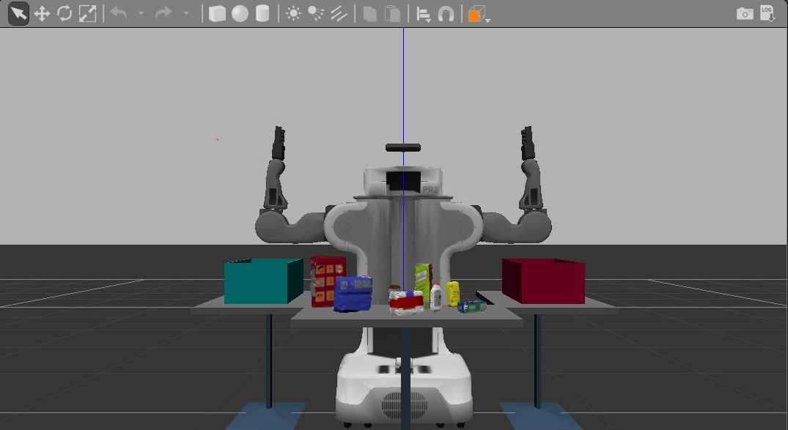

## Actual Camera input:

This image conatins the objects on the table with noise
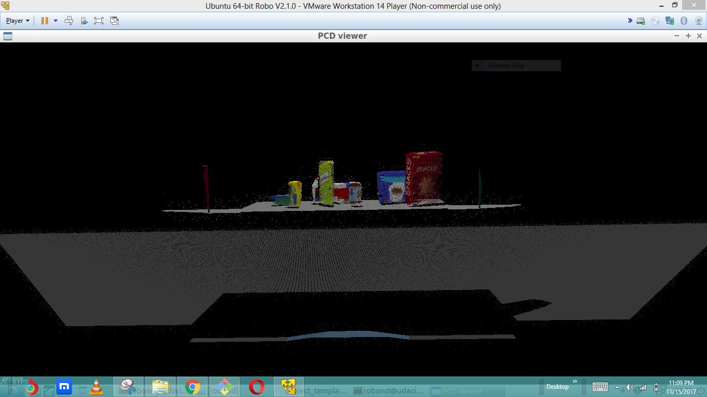

## Statistical Outlier Filtering 

The RGBD is stored as point cloud data to only keep the essential data, removing adversarial data points, and compressing the cloud data.

The raw point cloud object from the PR2 simulation looks the image above. After applying outlier filtering we can remove outliers from the point cloud. Any points whose mean distances are outside a defined interval are removed.

I have tuned the parameters for k = *20* and a standard deviation threshold of *0.1* provided the optimal outlier filtering. Here is the cloud after performing the outlier removal filter.

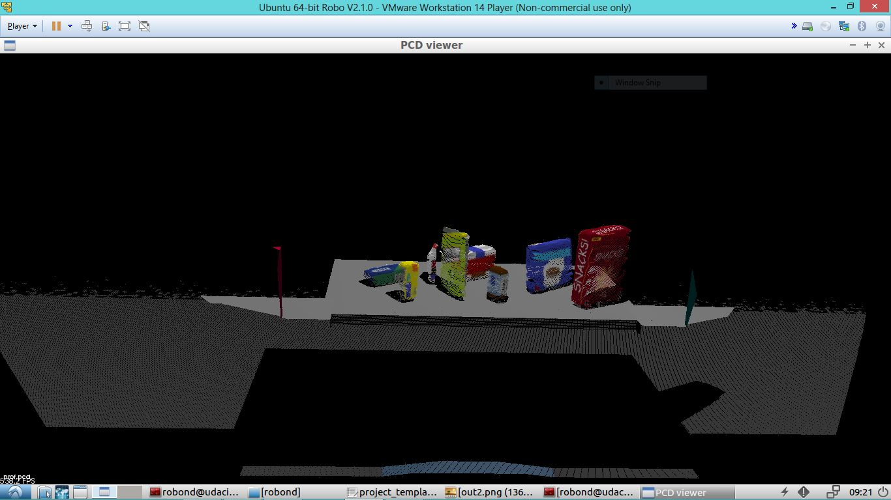

### Voxel Grid Filter

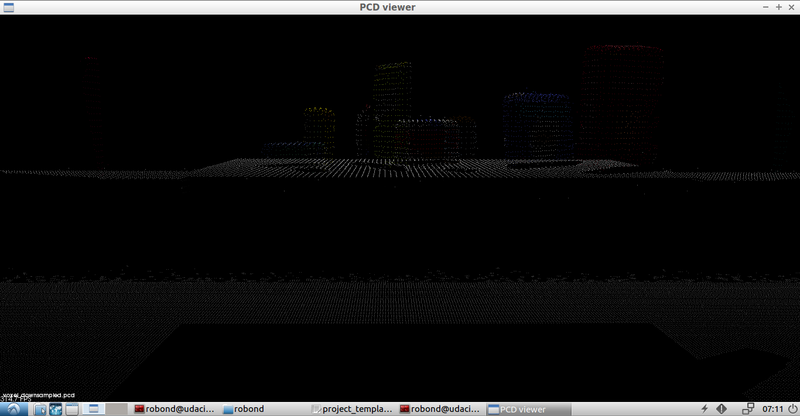

After filetring still the data in point is too high we which would require high computational power to process them
A voxel grid filter downsamples the data by taking a spatial average of the points in the cloud confined by each voxel. The set of points which lie within the bounds of a voxel are assigned to that voxel and are statistically combined into one output point.

I used an X, Y, and Z voxel grid filter leaf size = *0.01*. Which retains the required information, without losing the structure of the objects.

### Passthrough Filter

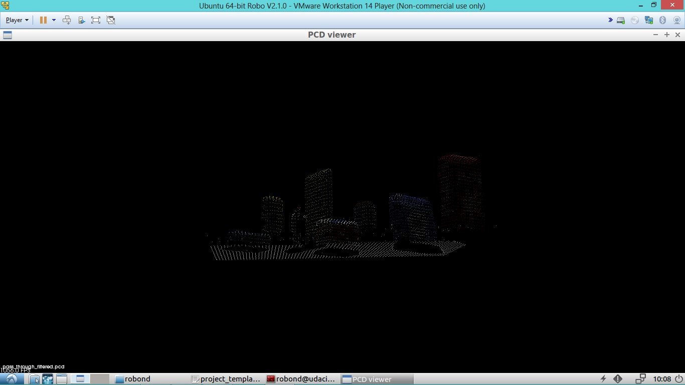

To crop out the unnecessary parts from the Point cloud we use Passthrough filter.

In PR2 robot simulation we use passthrough filters for both the Y and Z axis. For the Y axis, range was *-0.4* to *0.4*, and for the Z axis,range was *0.61* to *0.9*.

### RANSAC Plane Segmentation

Random Sample Consensus (RANSAC) is used to identify points in the dataset that belong to a particular model.RANSAC can be used to find a particular shape like plane, where to remove table we need a shap, which was a plane,and inliers which can be defined by a particular model with a specific set of parameters, and outliers don't.

I used a RANSAC max distance = *0.01*.

The extracted outliers contains the objects on the table, and looks like this:

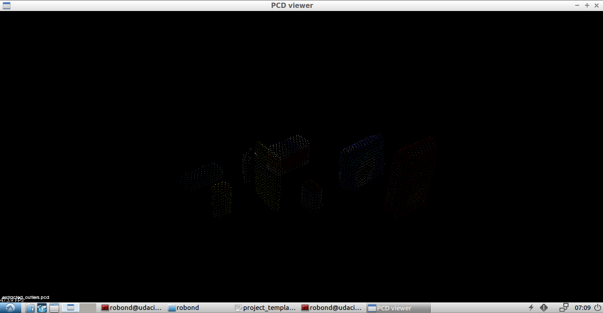

## Clustering for Segmentation

To seperate all the objects , where we have a clean point cloud data of outliers which are objects.
The two main algorithms possible include:

- K-means

- DBSCAN

### K-means

K-means clustering algorithm is able to group data points into n groups based on their distance to randomly chosen centroids.But the draw back with this algorithm is we have to know how many clusters , we need.

### DBSCAN

Density-based spatial cluster of applications with noise (DBSCAN) which clusters data points that are within some threshold distance from their nearest neighbor.

You don't need to know how many clusters to expect in the data. However, you do need to know something about the density of the data points being clustered.

DBSCAN within the PR2 simulation required converting the XYZRGB point cloud to a XYZ point cloud, making a k-d tree (decreases the computation required), preparing the Euclidean clustering function, and extracting the clusters from the cloud. This process generates a list of points for each detected object.

The parameters tuned are:
ClusterTolerance=0.05
MinClusterSize=100
MaxClusterSize=3000

By assigning random colors to the isolated objects within the scene, I was able to generate this cloud of objects:

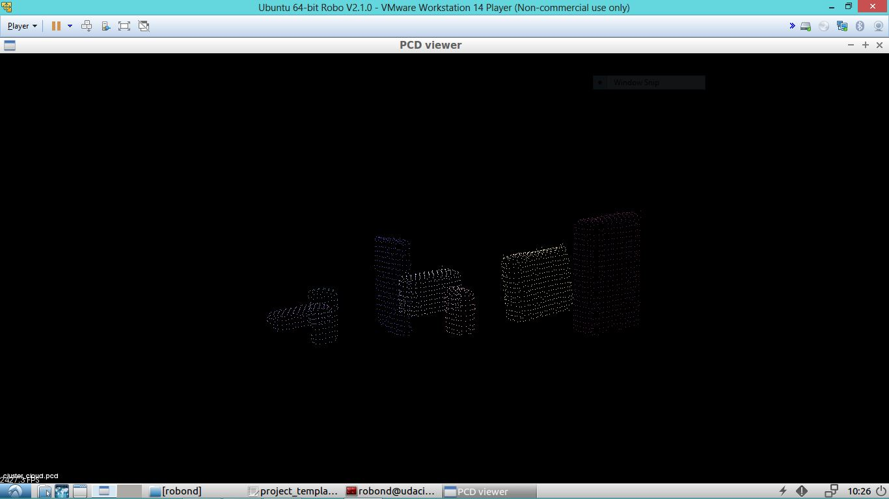

## Object Recognition

The object recognition code allows each object within the object cluster to be identified. In order to do this, the system first needs to train a model to learn what each object looks like. Once it has this model, the system will be able to make predictions as to which object it sees.

### Capture Object Features

Color histograms are used to measure how each object looks when captured as an image. Each object is positioned in random orientations to give the model a more complete understanding. For better feature extraction, the RGB image can be converted to HSV before being analyzed as a histogram.For capturing each object in *15* random orientations, using the *HSV* color space.
### Train SVM Model

A support vector machine (SVM) is used to train the model (specifically a SVC). The SVM loads the training set generated from the capture_features.py script, and prepares the raw data for classification. Parameters tuned , Kernel used is a *linear kernel* using a C value of *0.1* builds a model with good accuracy.

Cross validation of the model at *9* fold worked best.I got an accuracy score of 95%.
The confusion matrices below shows the non-normalized and normalized results for a test case using the trained model generated above.

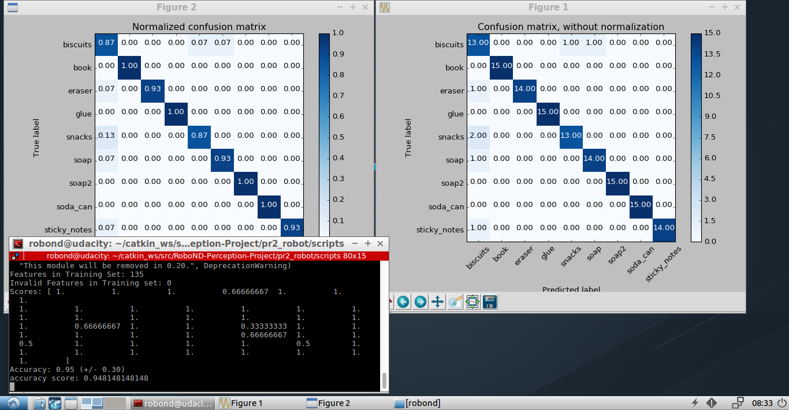

## PR2 Robot Simulation

The PR2 robot simulation has three test scenarios to evaluate the object recognition performance. The following sections demonstrate each scenario.

### Test 1

Test 1 object recognition:

``` python
Pick List:
object_list:
  - name: biscuits
    group: green
  - name: soap
    group: green
  - name: soap2
    group: red
```

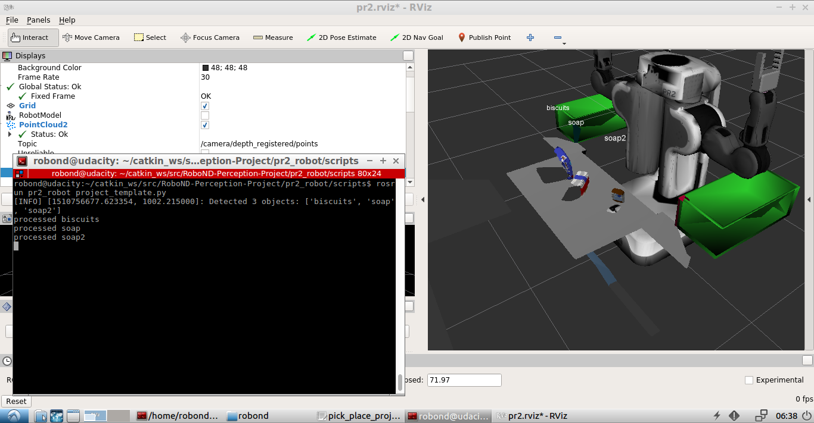
And the output values for World 1:
 [output values](RoboND-Perception-Project/pr2_robot/scripts/output_1.yaml).


### Test 2

Test 2 object recognition:

``` python
Pick List:
object_list:
  - name: biscuits
    group: green
  - name: soap
    group: green
  - name: book
    group: red
  - name: soap2
    group: red
  - name: glue
    group: red
```

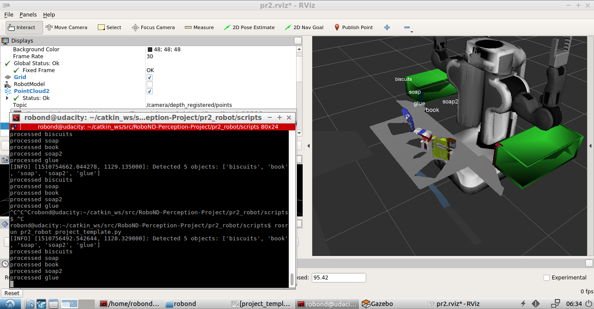
And the output values for World 2:
 [output values](RoboND-Perception-Project/pr2_robot/scripts/output_2.yaml).
 
 ### Test 3

Test 3 object recognition:

``` python
Pick List:
object_list:
  - name: sticky_notes
    group: red
  - name: book
    group: red
  - name: snacks
    group: green
  - name: biscuits
    group: green
  - name: eraser
    group: red
  - name: soap2
    group: green
  - name: soap
    group: green
  - name: glue
    group: red
```


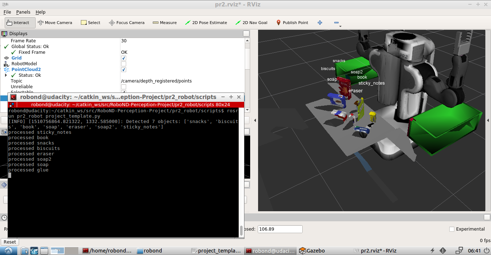
And the output values for World 3:
[output values](RoboND-Perception-Project/pr2_robot/scripts/output_3.yaml).

For the above tests:

|Test|Identification of objects|%|
|-----|--------|--|
|1|3/3|100|
|2|5/5|100|
|3|7/8|87.5|

I conclude that in the last test glue was not identified we can further increase the training set and improve the accuracy.I will further work on this project for pick and place. 

